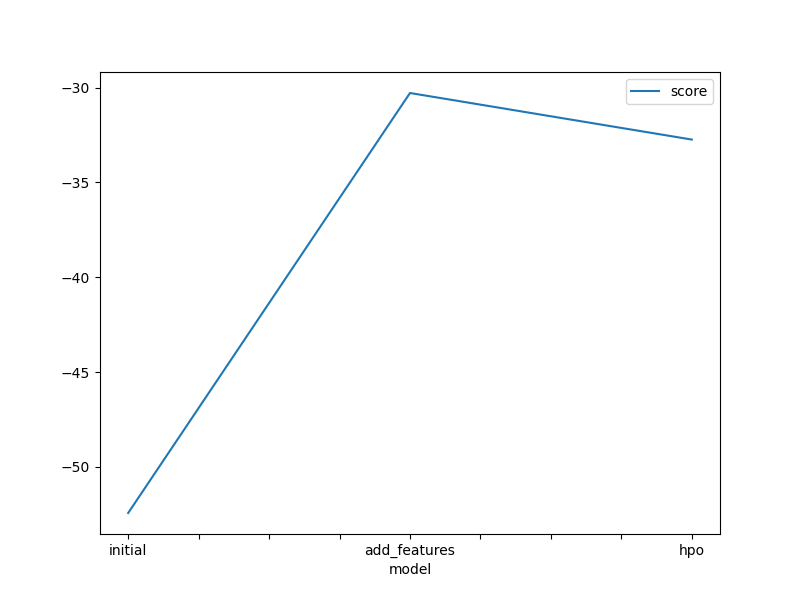
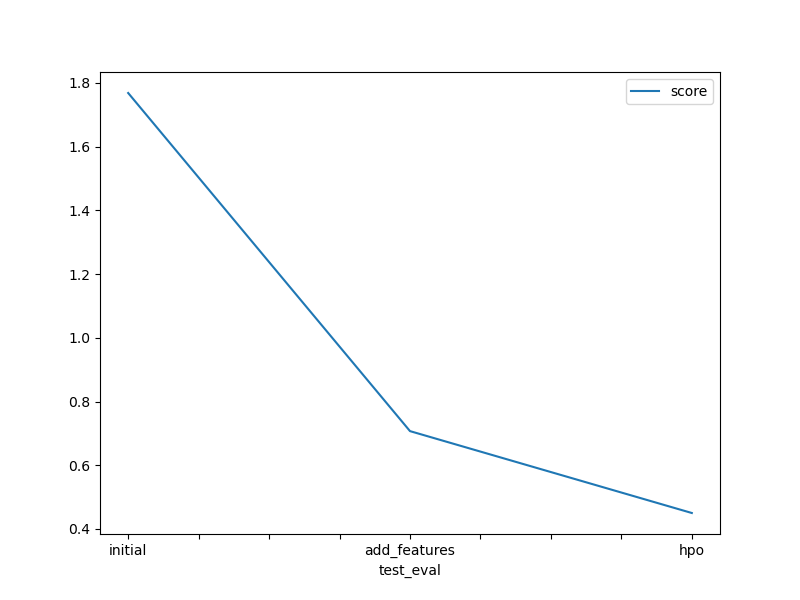

# Report: Predict Bike Sharing Demand with AutoGluon Solution
#### Edgar Matoto

## Initial Training
### What did you realize when you tried to submit your predictions? What changes were needed to the output of the predictor to submit your results?
Kaggle will reject submission if the prediction result contain negative value. So, the first thing to do before submit prediction results is to check negative value and replace them with 0.

### What was the top ranked model that performed?
The third experiment (hyperparameter optimization) obtain the best kaggle score of 0.45011. The top ranked model was the WeightedEnsemble_L3, with -32.739938	score_val. The model takes data that was perform with Exploratory Data Analysis (EDA) and feature engineering, with some hyperparameter optimization.

## Exploratory data analysis and feature creation
### What did the exploratory analysis find and how did you add additional features?
- Parsed 'datetime' feature data type from object to datetime
- Add additional feature (month, day, hour) obtain from datetime feature
- Parsed 'season' and 'weather' feature data type to category

### How much better did your model preform after adding additional features and why do you think that is?
The model perform from 1.76830 to 0.70709 (kaggle score). By adding additional features, it gives the model more spesific information to perform the predictor.

## Hyper parameter tuning
### How much better did your model preform after trying different hyper parameters?
after changing the hyperparameter of the (add feature) model from default to light, the performance of the model increase and obtain 0.45011 kaggle score.

### If you were given more time with this dataset, where do you think you would spend more time?
I would like to perform hyperparameter optimization to find the best prediction.

### Create a table with the models you ran, the hyperparameters modified, and the kaggle score.
|model|hpo1|hpo2|hpo3|score|
|--|-|-|-|-|
|initial|time_limit=600|presets=best_quality|hyperparameter=default|1.76690|
|add_features|time_limit=600|presets=best_quality|hyperparameter=default|0.70968|
|hpo|time_limit=600|presets=best_quality|hyperparameter=light|0.44776|

### Create a line plot showing the top model score for the three (or more) training runs during the project.

### Create a line plot showing the top kaggle score for the three (or more) prediction submissions during the project.

## Summary
- The AutoGluon framework helps to perform bike sharing demand prediction by leveraging AutoML capabilities. It helps to automate and find the best baseline model.
- The model perform improve significantly by applying exploratory data analysis (EDA) and feature engineering
- Hyperparameter optimization can help the model to improve and perform better.
